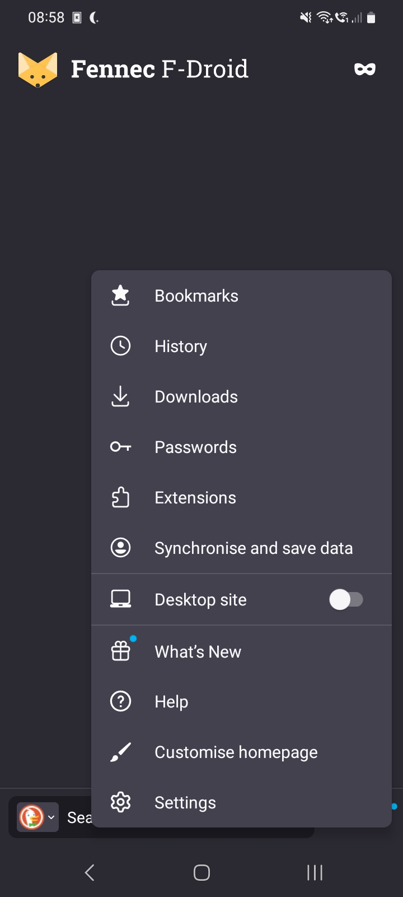
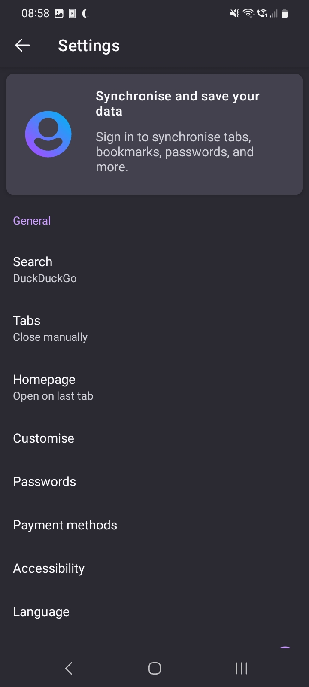
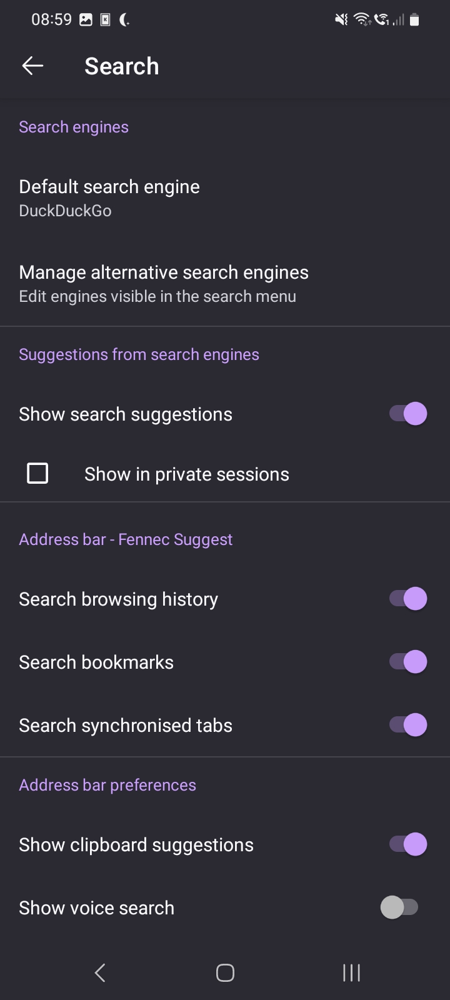
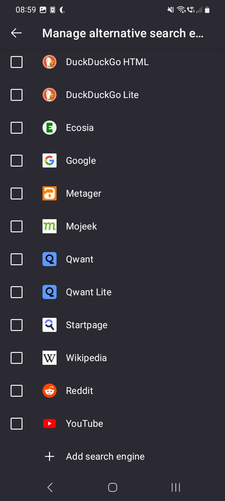
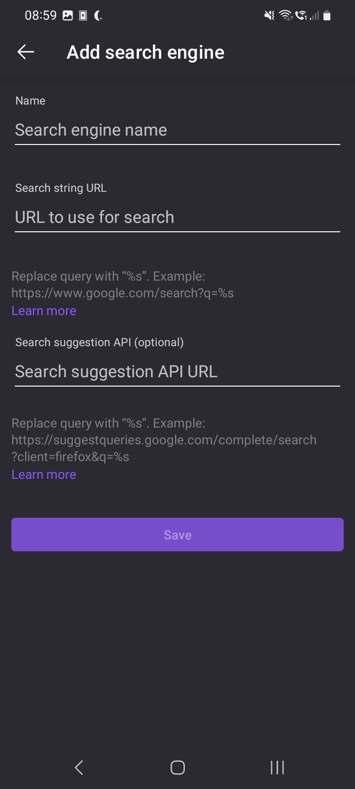
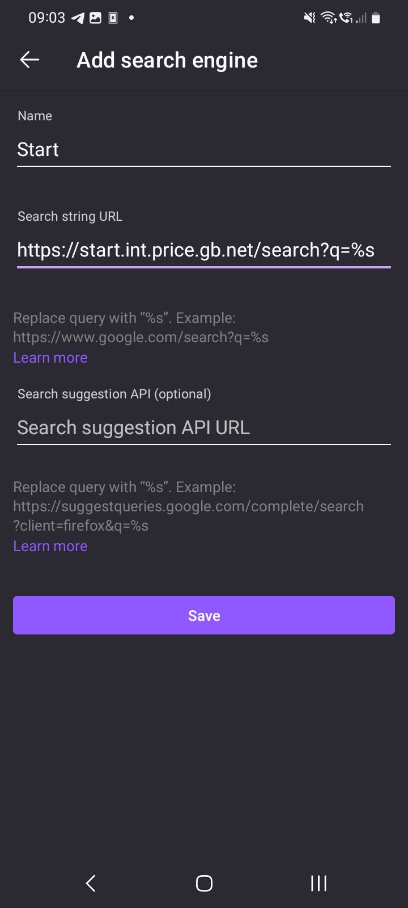
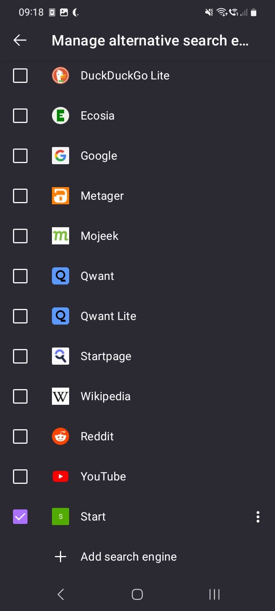
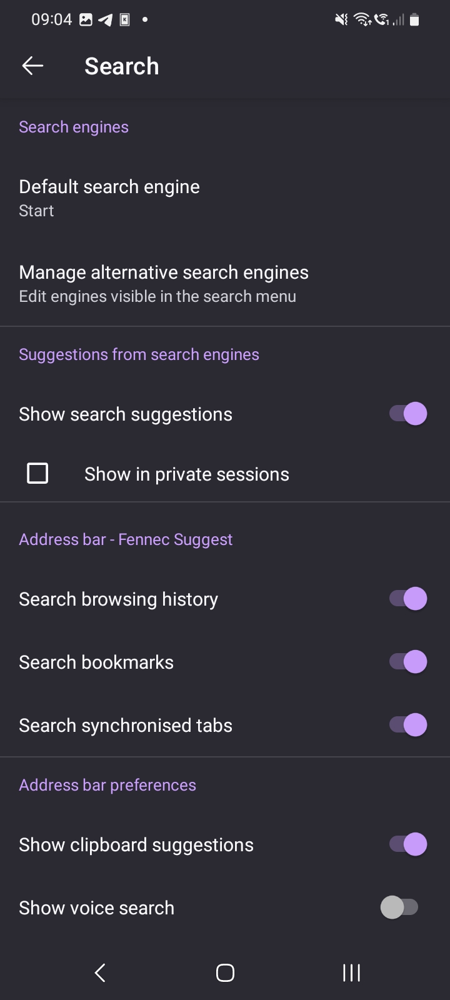
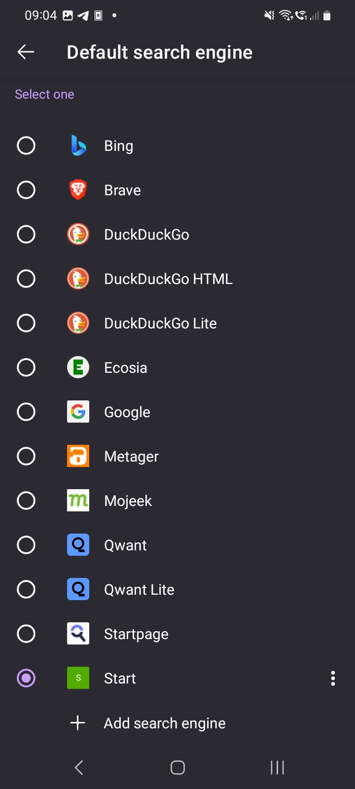

---
aliases:
  - add-a-custom-search-engine-to-firefox-android
category: firefox
classification: public
date: 2024-10-18T08:09:48
date_modified: 2024-10-18T08:09:48
draft: false
id: 20241018080948
image: 
links: 
local_archive_links: 
pinned: false
print: false
series: 
tags:
  - firefox
  - android
  - search-engine
  - f-droid
  - custom
  - query
title: Add a Custom Search Engine to Firefox Android
type: tech-note
---

Open Firefox for Android (or whatever variant you may be using - in my case Fennec F-Droid), and click the 3 vertical dots to open up the main menu. Then click "Settings".

Next, click "Search".

Then click "Manage alternative search engines".

Now scroll to the bottom of this list and click "Add search engine".

In the screen that appears, we'll need to fill in "Search engine name" and "URL to use for search".

In our case, those values are: `Start` and `https://start.int.price.gb.net/search?q=%s`. Once filled in, click "Save".

Now select the search engine we've just created, and go click the back arrow to go back.

Select the "Default search engine" option.

Change it to "Start". 

That's it, all done.
