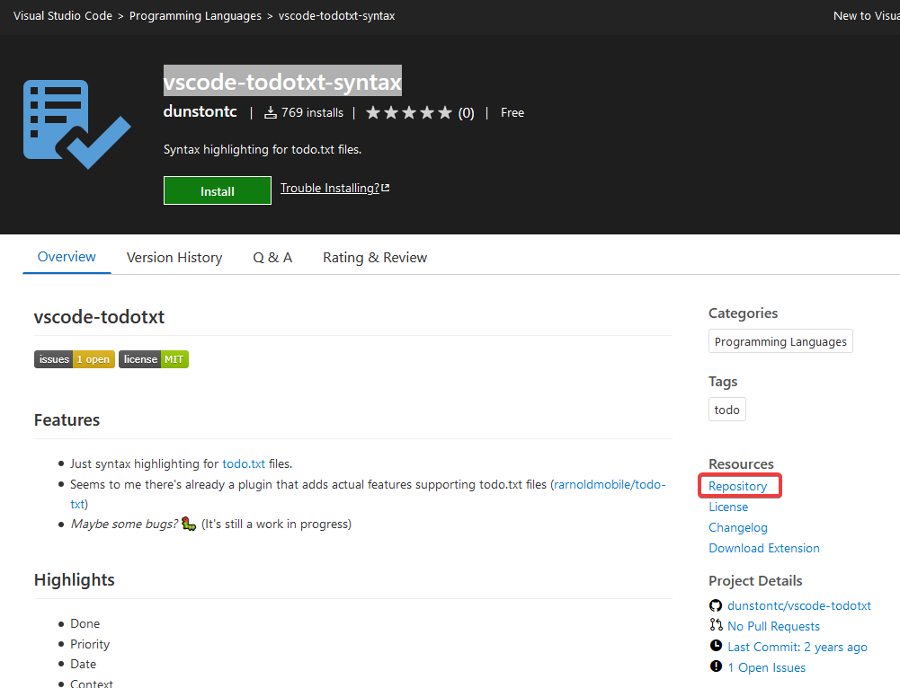

---
aliases:
  - download-vsix-for-any-vscode-extension
category: vscode
classification: public
date: 2020-10-21T10:00:20
date_modified: 2020-10-21T10:00:20
draft: false
id: 20201021100020
image: 
links: 
local_archive_links: 
pinned: false
print: false
series: 
tags:
  - extensions
  - vscode
  - vsix
title: Download the VSIX for Any VS Code Extension
type: tech-note
---

> [!tip]
> The `.vsix` file is simply a zip archive. You can unzip it and see the contents.

You can get the details needed to fill in the required parameters from the `package.json` of any extension you wish to download. This can be found in the extension's repository on GitHub.

The download link is structured as follows:

```sh
https://${publisher}.gallery.vsassets.io/_apis/public/gallery/publisher/${publisher}/extension/${extensionname}/${version}/assetbyname/Microsoft.VisualStudio.Services.VSIXPackage
```

Let's say you want to download `vscode-todotxt-syntax` located [here](https://marketplace.visualstudio.com/items?itemName=dunstontc.vscode-todotxt). You can find the repository link under the `Resources` header on the right sidebar, as below:



Then from within the repository you can open up [package.json](https://github.com/dunstontc/vscode-todotxt/blob/master/package.json) which will contain something like the below. 

```json
{
  "name": "vscode-todotxt",
  "displayName": "vscode-todotxt-syntax",
  "description": "Syntax highlighting for todo.txt files.",
  "version": "1.0.4",
  "publisher": "dunstontc",
  "repository": {
    "type": "git",
    "url": "https://github.com/dunstontc/vscode-todotxt.git"
  },
  "engines": { "vscode": "^1.21.0" },
  "categories": ["Programming Languages"],
  "galleryBanner": {
    "color": "#1e1e1e",
    "theme": "dark"
  },
  "icon": "assets/logo.png",
  "scripts": {"build": "json5 ./src/todo.tmLanguage.json5 -o ./syntaxes/todo.tmLanguage.json -s 2;"},
  "contributes": {
    "languages": [{
      "id": "todo",
      "aliases": [
        "todo",
        "todo"
      ],
      "extensions": [
        "todo.txt",
        "done.txt"
      ],
      "configuration": "./language-configuration.json"
    }],
    "grammars": [{
      "language": "todo",
      "scopeName": "source.todo",
      "path": "./syntaxes/todo.tmLanguage.json"
    }]
  }
}
```

This has all the details we need to populate the `.vsix` download link as below:

```sh
https://dunstontc.gallery.vsassets.io/_apis/public/gallery/publisher/dunstontc/extension/vscode-todotxt/1.0.4/assetbyname/Microsoft.VisualStudio.Services.VSIXPackage
```

You now have a link that will let you download the built `.vsix` extension, which can then be manually imported into VS Codium. 

The link will return a file called `Microsoft.VisualStudio.Services.VSIXPackage` which you can rename to `<extension_name>.vsix` and save in your own personal extension library.

This saves you from having to clone the repository and build it yourself, and allows you to download any extension offered on the VS Code Marketplace, even if your using VSCodium.