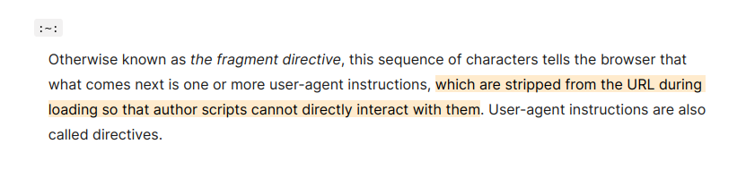

---
aliases:
  - highlight-text-on-page
category: firefox
classification: public
date: 2025-02-11T11:34:34
date_modified: 2025-02-11T11:34:34
draft: false
id: 20250211113434
image: 
links:
  - https://developer.mozilla.org/en-US/docs/Web/URI/Fragment/Text_fragments
local_archive_links:
  - attachments/highlight_text_on_page.html
pinned: false
print: false
series: 
tags:
  - highlight
  - uri
  - link
  - share
  - text-fragment
  - firefox
  - chromium
title: Highlight Text on Page
type: tech-note
---

I recently realised that Firefox gained the ability (in version 131) to share a link that highlights a specific portion of text on a web page. You currently have to do it manually, as opposed to Chrome which has the "Copy link to highlight" option in it's right-click menu (but I don't use Chromium browsers).

In other words, if there's a sentence you want to show somebody on a web page, you can share a link with them that will actually highlight the sentence on the page for them as well (and open the page and scroll to that highlight), when they click the link.

MDN describes it in detail:

> **Text fragments** allow linking directly to a specific portion of text in a web document, without requiring the author to annotate it with an ID, using particular syntax in the URL fragment. Supporting browsers are free to choose how to draw attention to the linked text, e.g. with a color highlight and/or scrolling to the content on the page. This is useful because it allows web content authors to deep-link to other content they don't control, without relying on the presence of IDs to make that possible. Building on top of that, it could be used to generate more effective content-sharing links for users to pass to one another.

Syntax is as follows:

```
https://example.com#:~:text=[prefix-,]textStart[,textEnd][,-suffix]
```

At it's most basic, most people can probably ignore the `prefix`, `textEnd` and `suffix`, so you end up with something like this:

```
https://example.com#:~:text=hello world
```

Here's a real example:

```
https://developer.mozilla.org/en-US/docs/Web/URI/Fragment/Text_fragments#:~:text=which are stripped from the URL during loading so that author scripts cannot directly interact with them
```

It looks like this to anybody clicking the link:

