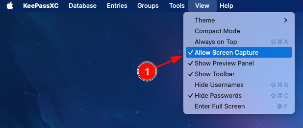

---
aliases:
  - keepassxc-not-displaying-on-primary-screen-whilst-using-displaylink-on-macos
category: macos
classification: public
date: 2025-01-16T16:02:56
date_modified: 2025-01-16T16:02:56
draft: false
id: 20250116160256
image: 
links:
  - https://www.reddit.com/r/KeePass/comments/1crz021/keepassxc_doesnt_display_macos/
local_archive_links:
  - attachments/keepassxc_not_displaying_on_primary_screen_whilst_using_displaylink_on_macos.html
pinned: false
print: false
series: 
tags:
  - displaylink
  - keepassxc
  - macos
title: KeePassXC Not Displaying on Primary Screen Whilst Using DisplayLink on macOS
type: tech-note
---

I have my work MacBook connected to a DisplayLink dock that runs three monitors, and I was experiencing a strange issue where KeePassXC would open on the middle (primary) monitor but be invisible unless I moved it to my left or right monitor. 

After weeks of being annoyed by it (but not enough to look up a fix), thanks to [r/KeePass](https://www.reddit.com/r/KeePass/comments/1crz021/keepassxc_doesnt_display_macos/) it turns out it's a really simple fix.

You just need to click "View > Allow Screen Capture".

