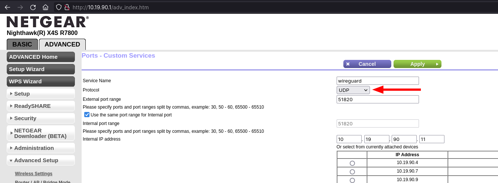

---
aliases:
  - setup-wireguard
category: network
classification: public
date: 2023-01-08T12:21:34
date_modified: 2023-01-08T12:21:34
draft: false
id: 20230108122134
image: 
links:
  - https://www.digitalocean.com/community/tutorials/how-to-set-up-wireguard-on-ubuntu-22-04
local_archive_links:
  - attachments/20230108122134.html
pinned: false
print: false
series: 
tags:
  - wireguard
  - vpn
title: Setup WireGuard on Debian
type: tech-note
---

((TOC))

> [!important]
> This only works if your internet provider isn't using CGNAT. If that's the case, you must use a VPS, as described in [[20231209103435]].

> [!info]
> Worth bearing in mind, I've now gone the Docker route with this, using [wg-easy/wg-easy: The easiest way to run WireGuard VPN + Web-based Admin UI.](https://github.com/wg-easy/wg-easy)

I've extracted what I needed to do from the clearest article I found on setting up WireGuard - [How To Set Up WireGuard on Ubuntu 22.04 | DigitalOcean](https://www.digitalocean.com/community/tutorials/how-to-set-up-wireguard-on-ubuntu-22-04) 

> [!important]
> You must set `UDP` as the protocol when setting up the port forwarding rule on your router. Initially, I missed this and things were not working, with no obvious reason for ages (like 48 hours before I realised)!



## Server

### Install WireGuard & Extras

```sh
sudo apt update
sudo apt install ufw wireguard wireguard-tools
```

### Generate Public & Private Key

#### Private Key

```sh
wg genkey | sudo tee /etc/wireguard/private.key
sudo chmod go= /etc/wireguard/private.key
```

#### Public Key

```sh
sudo cat /etc/wireguard/private.key | wg pubkey | sudo tee /etc/wireguard/public.key
```

### Create WireGuard Server Configuration File

Create a WireGuard configuration file at `/etc/wireguard/wg0.conf`.

```ini
[Interface]
PrivateKey = <private-key-goes-here>
Address = 10.8.0.1/24
ListenPort = 51820
SaveConfig = true
```

### Enable IP Forwarding

Uncomment the below line in `/etc/sysctl.conf`.

```sh
net.ipv4.ip_forward=1
```

Reload sysctl.

```sh
sudo sysctl -p
```

### Update WireGuard Server Configuration with Firewall Rules

Add the below rules to your `wg0.conf`, and make sure that `eth0` is your primary network interface's name.

```ini
PostUp = ufw route allow in on wg0 out on eth0
PostUp = iptables -t nat -I POSTROUTING -o eth0 -j MASQUERADE
PreDown = ufw route delete allow in on wg0 out on eth0
PreDown = iptables -t nat -D POSTROUTING -o eth0 -j MASQUERADE
```

### Open Up Firewall Ports

```sh
sudo ufw allow 51820/udp
sudo ufw allow OpenSSH
sudo ufw disable
sudo ufw enable
```

### Start WireGuard on the Server

The server's `wg0.conf` should now look like the below.

```ini
[Interface]
PrivateKey = <private-key-goes-here>
Address = 10.8.0.1/24
ListenPort = 51820
PostUp = ufw route allow in on wg0 out on eth0
PostUp = iptables -t nat -I POSTROUTING -o eth0 -j MASQUERADE
PreDown = ufw route delete allow in on wg0 out on eth0
PreDown = iptables -t nat -D POSTROUTING -o eth0 -j MASQUERADE
SaveConfig = true
```

You can now start it using `systemd`.

```sh
sudo systemctl enable --now wg-quick@wg0.service
```

## Peer

### Install WireGuard

Install WireGuard on the peer.

### Generate Public & Private Key

#### Private Key

```sh
wg genkey | sudo tee /etc/wireguard/private.key
sudo chmod go= /etc/wireguard/private.key
```

#### Public Key

```sh
sudo cat /etc/wireguard/private.key | wg pubkey | sudo tee /etc/wireguard/public.key
```

### Create WireGuard Server Configuration File

Create a WireGuard configuration file at `/etc/wireguard/wg0.conf`.

```ini
[Interface]
PrivateKey = <peer-private-key>
Address = 10.8.0.2/24
DNS = 10.19.90.5

[Peer]
PublicKey = <servers-public-key>
AllowedIPs = 10.8.0.0/24
Endpoint = <server-ip-or-hostname>:51820
```

### Add Peer's Public Key to WireGuard Server

Copy the contents of the peer's public key.

```sh
sudo cat /etc/wireguard/public.key
```

Then from the WireGuard server, run the following.

```sh
sudo wg set wg0 peer <peers-public-key> allowed-ips 10.8.0.2
```

Restart the WireGuard service if running, and then check the peer has been added, either by `cat /etc/wireguard/wg0.conf` or `wg show`.

### Connect from Peer to Server

On the peer, you can bring the WireGuard tunnel up, by running `wg-quick`.

```sh
wg-quick up wg0
```

To bring the tunnel down, run the below.

```sh
wg-quick down wg0
```
