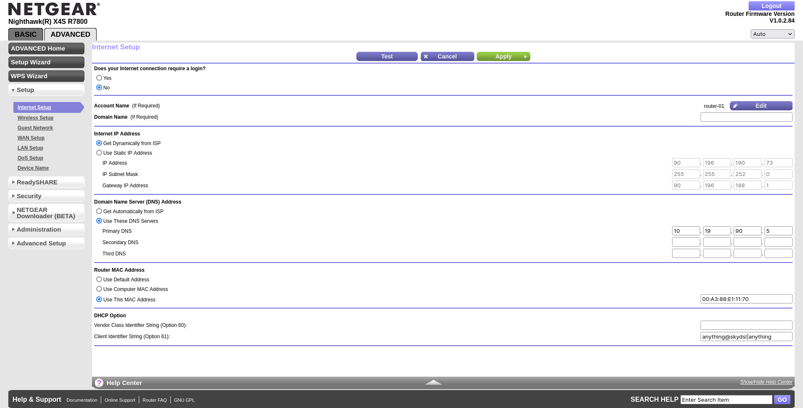
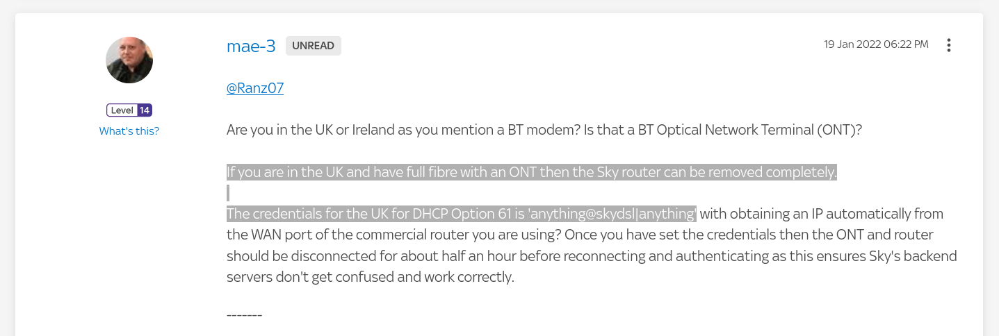

---
aliases:
  - sky-fibre-setup-with-another-router
archive_links:
  - https://web.archive.org/web/20240923200754/https://helpforum.sky.com/t5/Broadband/PPPOE-codes-for-connection-to-third-party-router/m-p/3899878
category: network
classification: public
date: 2022-07-18T20:21:53
date_modified: 2024-09-23T21:13:34
draft: false
id: 20220718202153
image: 
links:
  - https://helpforum.sky.com/t5/Broadband/PPPOE-codes-for-connection-to-third-party-router/m-p/3899878#M284210
local_archive_links:
  - attachments/20220718202153.html
pinned: false
print: false
series: 
tags:
  - sky
  - fibre
  - ont
  - broadband
  - openreach
  - fttp
  - client-identifier-string
  - option-61
title: Sky Fibre Setup with Netgear R7800 Router
type: tech-note
---

Setup is _really_ easy. No need to use the Sky Router at all. 

Under `Advanced Setup` on the R7800 [Administration Page](http://10.19.90.1/adv_index.htm) go to `Setup` > `Internet Setup`, and under `DHCP Option` you should see a field for `Client Identifier String (Option 61)`. Paste the following string into the text field:

```
anything@skydsl|anything
```

You can replace the `anything` but you actually don't need to. Once you click `Apply`, you should immediately pick up an IP Address in the `Internet IP Address` section, as long as `Get Dynamically from ISP` is selected.

Screenshot of the settings below.



Screenshot of the comment below and [here](https://helpforum.sky.com/t5/Broadband/PPPOE-codes-for-connection-to-third-party-router/m-p/3899878#M284210) at Sky's community forum.



