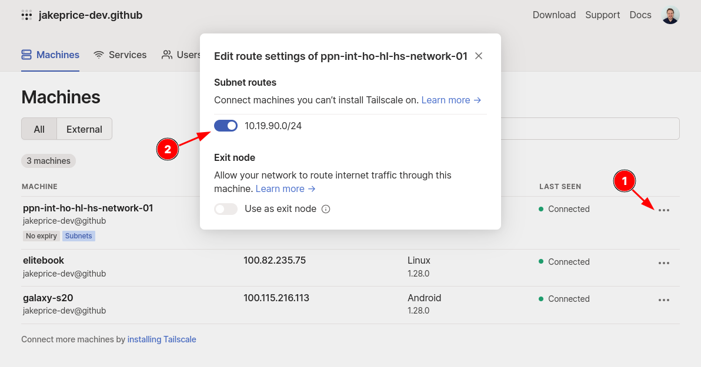
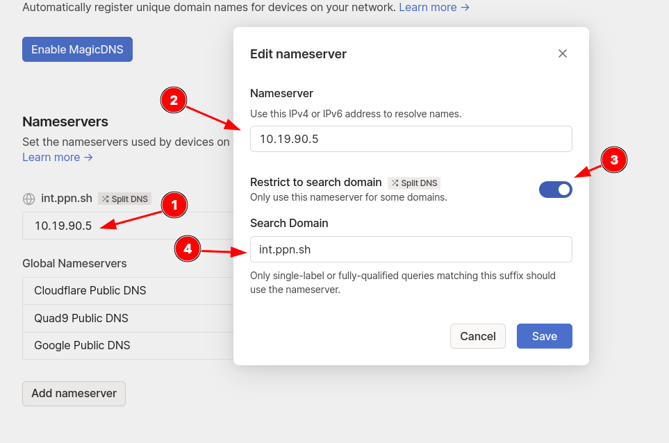
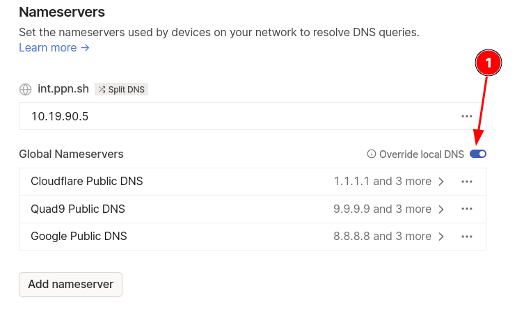

---
aliases:
  - tailscale-setup-with-split-dns
category: network
classification: public
date: 2022-08-09T09:35:34
date_modified: 2022-08-09T09:35:34
draft: false
id: 20220809093534
image: 
links:
  - https://login.tailscale.com/
local_archive_links: 
pinned: false
print: false
series: 
tags: [vpn, ppn, wireguard, tailscale, network, router]
title: Tailscale Setup & Split DNS
type: tech-note
---

I have Tailscale installed on `network-01`, using a [Subnet Router](https://tailscale.com/kb/1019/subnets/). 

Ansible installs it, but you can follow the instructions [here](https://tailscale.com/download).

I start Tailscale by running the below command on `network-01` (making sure IP forwarding has been enabled), which then has you authorise the connection by clicking a link (or as I do with Ansible, use auth keys, [here](https://login.tailscale.com/admin/settings/keys)).

```sh
# Bring up subnet router and advertise routes:
sudo tailscale up --advertise-routes=10.19.90.0/24
```

You then need to enable the subnet router from [Machines](https://login.tailscale.com/admin/machines), by turning the switch to "On" as below.



Then turn on IP forwarding, and restart the server. More [here](https://tailscale.com/kb/1019/subnets/#enable-ip-forwarding).

```sh
echo 'net.ipv4.ip_forward = 1' | sudo tee -a /etc/sysctl.conf
echo 'net.ipv6.conf.all.forwarding = 1' | sudo tee -a /etc/sysctl.conf
sudo sysctl -p /etc/sysctl.conf
```

On Android you don't need to do anything else, the routes will be automatically picked up as described below.

> Clients on Windows, macOS, iOS, and Android will automatically pick up your new subnet routes.
>
> — [Subnet routers and traffic relay nodes · Tailscale](https://tailscale.com/kb/1019/subnets/#step-2-connect-to-tailscale-as-a-subnet-router)

On Linux devices only, such as my EliteBook, you need accept the routes when bringing Tailscale up.

```sh
sudo tailscale up --accept-routes
```

## Split DNS

To make sure you can access `int.ppn.sh` sites and other LAN devices from devices connected to Tailscale, we need to add the 10.19.90.5 DNS server, and specify a "Search Domain".



Next, add some additional Global Nameservers for redundancy, and set the "Override local DNS" button to "On". This makes it so that by default, clients will use the global DNS servers, as opposed to 10.19.90.5, but, because we've added a Search Domain, when `int.ppn.sh` or queries to 10.19.90.0 devices are made, the 10.19.90.5 DNS server will be used. So, Split DNS.



That's it, no opening ports on the router, no manual WireGuard configs, it's as easy as this. Very cool.
