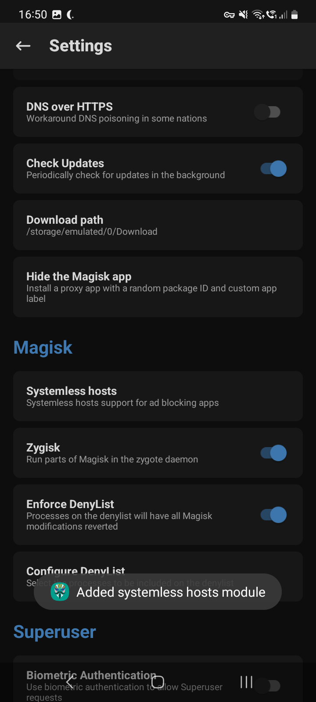

---
aliases:
  - update-hosts-file-on-rooted-android
category: android
classification: public
date: 2024-06-24T16:48:51
date_modified: 2024-06-24T16:48:51
draft: false
id: 20240624164851
image: 
links: 
local_archive_links: 
pinned: false
print: false
series: 
tags:
  - android
  - hosts
  - magisk
  - root
title: Update hosts File on Rooted Android
type: tech-note
---

Enable "Systemless hosts" from within the Settings screen in Magisk.



This creates and then overrides the default `hosts` file. You can then add your entries to  `/data/adb/modules/hosts/system/etc/hosts`.

However you can't easily edit the file on Android itself via Termux or ADB because when your `su` you don't seem to be able to install Vim or similar, so I create a local version of a `hosts` file to use and then upload it in a roundabout way to avoid lack of permissions issues.

```sh
# Push file from local machine to phone:
$ adb push <local-machine-path-to-hosts> /sdcard/Download/

# Move (overwrite) the existing systemless hosts file:
$ adb shell
$ su
# cp /sdcard/Download/hosts /data/adb/modules/hosts/system/etc/
```

You then need to restart the phone (manually or below) for it to take effect.

```
# adb reboot
```