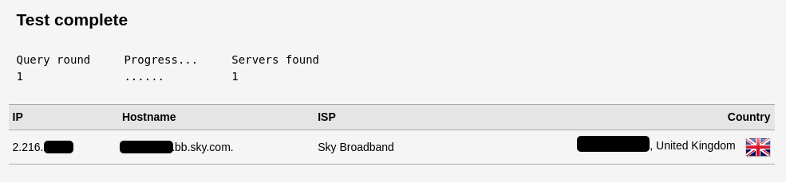

I needed to verify that my Unbound DNS server (which is, as of a few weeks ago now running as a service on my OpenWRT router as opposed to a Raspberry Pi) was actually resolving it's own queries and not passing them off to Google or Cloudflare. 

Turns out it's simply a case of running a DNS Leak Test. I used the one [here](https://dnsleaktest.com).

If Unbound is working and resolving locally then you should see your ISP provided IP address.

