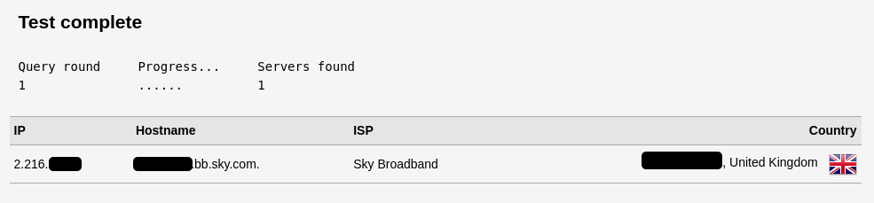

---
aliases:
  - verify-if-unbound-is-resolving-dns-queries-locally
archive_links: 
category: network
classification: public
date: 2023-11-03T21:43:53
date_modified: 2023-11-03T21:43:53
draft: false
id: 20231103214353
image: 
links:
  - https://old.reddit.com/r/pihole/comments/etp9vm/how_do_i_verify_if_unbound_is_working/
local_archive_links:
  - attachments/20231103214353.html
pinned: false
print: false
series: 
tags: [unbound, dns, recursive, resolve]
title: Verify if Unbound is Resolving DNS Queries Locally
type: tech-note
---

I needed to verify that my Unbound DNS server (which is, as of a few weeks ago now running as a service on my OpenWRT router as opposed to a Raspberry Pi) was actually resolving it's own queries and not passing them off to Google or Cloudflare. 

Turns out it's simply a case of running a DNS Leak Test. I used the one [here](https://dnsleaktest.com).

If Unbound is working and resolving locally then you should see your ISP provided IP address.

